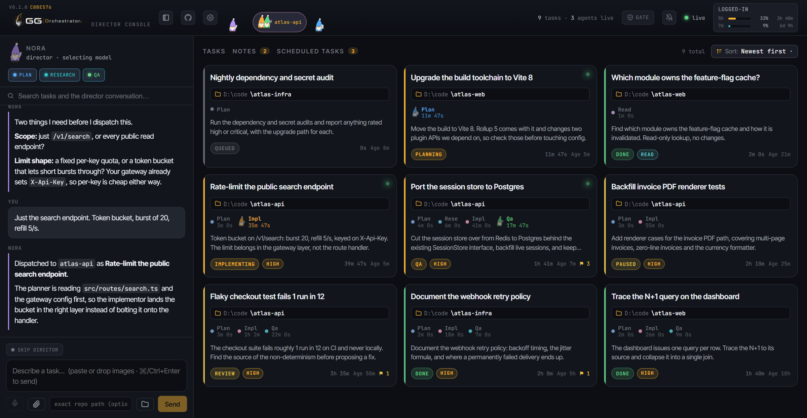
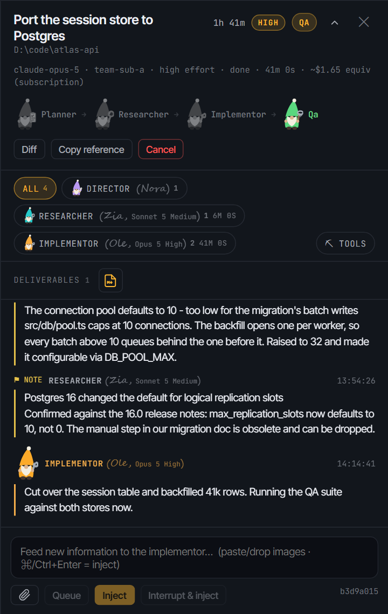
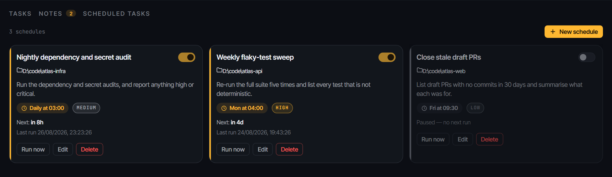
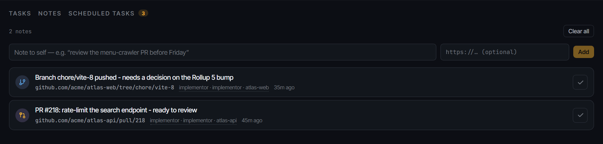

# GG Orchestrator

**Run five coding agents at once and actually stay on top of them.**

A local director's console for Claude Code. You describe a task in plain language;
a director agent asks the questions you'd otherwise forget to answer, then hands the
brief to a pipeline that plans, researches, builds and reviews it. Every task is a
card on a live board you can watch, interrupt, feed new information to, and resume.



It runs on your machine, against your repos, on your Claude subscription. There is no
hosted service and no metered API billing.

## Why it exists

The workflow this replaces is one people already do by hand:

1. Get a model to sharpen a rough prompt into a real brief.
2. Have it read the codebase enough to plan.
3. Start a strong agent on the work.
4. Stop it and feed it new information when something changes the picture.
5. Review what came back.

That is fine for one task. At five concurrent tasks you lose track of which agent knows
what, which one is stuck, and which one quietly finished twenty minutes ago. This is the
console for that problem.

## How a task runs

A dispatched task is a **thread**, and the pipeline assembles itself. There is no fixed
sequence: each agent decides what happens next.

- **Planner, always first.** Reads the codebase, writes the plan, and declares what comes
  next: a researcher, if the task needs information that is not in the repo, or straight
  to the implementor.
- **Researcher, optional and external only.** Web search, library docs, changelogs, issue
  threads. It deliberately does not read the codebase, because that is the planner's job.
- **Implementor.** Does the work. It is fully autonomous and it *cannot* declare itself
  done; it always hands off.
- **QA.** Reviews and tests against the brief. It is the only role that can mark a task
  **done**, and it can bounce work back to the implementor with concrete fixes, looping
  until the task passes or runs out of rounds.

Each finished stage is persisted, so a task that dies mid-pipeline (crash, restart,
rate limit) resumes from where it stopped rather than starting over.

**A pure lookup skips all of it.** "Which module owns the feature-flag cache?" does not
need a planner or a QA round, so the director dispatches it down a **read lane**: one
read-only agent answers by posting a finding, and the card gets a `READ` badge. If the
question turns out to need an edit, it escalates to the full pipeline instead of
half-answering.

**When a task parks for your review, you can delegate that too.** "Auto-review and mark
done" hands your review to a reviewer agent that inspects the change, runs the project's
checks, and asks you directly about anything only you can decide. It then marks the task
done in your place or hands it back with the reasons it could not sign off. It reviews
only: it never edits or commits.

## A look around

Open a task and you get its whole trail: which agents ran, what they cost, what they
found, and any file they produced. The composer at the bottom injects new information
into the running agent without restarting it.



Findings are how agents talk to each other and to you. An agent posts one the moment it
learns something that changes the plan, so a discovery made by the researcher is in front
of the implementor before it writes the wrong thing.

**Recurring work runs itself.** A nightly audit or a weekly flake sweep is a schedule, not
a reminder to dispatch it by hand.



**Anything waiting on you personally lands in one list.** Agents post a branch or a PR here
when they need you to look; you click it, deal with it, and delete the line.



Also in the console: a per-repo chat room so concurrent agents on the same checkout do not
clobber each other, an in-app git surface for branches, diffs and commits, search across
every task's full conversation, and opt-in browser, Discord or webhook notifications when
a task finishes or needs you.

## Runtime model

Every backend authenticates off a flat-fee subscription rather than a metered API key.
The server deliberately strips `ANTHROPIC_API_KEY` from the agent environment so a stray
key cannot silently route your agents onto per-token billing.

Claude runs through the [Claude Agent SDK](https://www.npmjs.com/package/@anthropic-ai/claude-agent-sdk),
which drives the Claude Code binary and inherits your existing CLI login. Default models:

| Role | Model |
| --- | --- |
| Director | `claude-sonnet-5` |
| Planner | `claude-opus-5` |
| Researcher | `claude-sonnet-5` |
| Implementor | `claude-opus-5` |
| QA | `claude-opus-5` |
| Reader (read lane) | `claude-sonnet-5` |
| Reviewer (auto-review) | `claude-opus-5` |

Three other backends are optional, off by default, and enabled per machine under
**Settings > Subscriptions**: **OpenAI Codex** (ChatGPT plan), **xAI Grok** (SuperGrok),
and **Zhipu z.ai** (GLM Coding Plan). If Claude caps mid-task, work fails over to whichever
enabled backend still has headroom instead of stopping.

**More than one Claude subscription?** Set `ACCOUNT_1_TOKEN`, `ACCOUNT_2_TOKEN` and so on
(up to 8). Dispatches route to burn the perishable weekly allowance first, and the top bar
shows live 5-hour and weekly usage per subscription.

## Quick start

Requires **Node 22 or newer** (not enforced anywhere, but that is what it is developed and
run against) and a working `claude` CLI login.

```bash
git clone https://github.com/Fearce/garden-gnome-orchestrator.git
cd garden-gnome-orchestrator

npm install          # the repo root; installs concurrently, used by dev/serve
npm run install:all  # server/, web/ and relay/

npm run serve        # server + web console
```

Then open <http://127.0.0.1:4317>.

Nothing has to be configured to start. Every setting has a default, and the Agent SDK
picks up the credentials your `claude` CLI already has.

For a headless or always-on setup, where there is no interactive CLI login to inherit,
mint a subscription token and put it in `server/.env`:

```bash
claude setup-token   # then: CLAUDE_CODE_OAUTH_TOKEN=... in server/.env
```

Runs on macOS, Linux and Windows.

<details>
<summary><b>Linux and npm 12: two extra first-run steps</b></summary>

`better-sqlite3` is a native addon, and npm 12 blocks package build scripts by default, so
its `node-gyp rebuild` never runs and the server crashes at boot with *"Could not locate the
bindings file"*. Approve it once:

```bash
cd server
npm install-scripts approve better-sqlite3
npm rebuild better-sqlite3
```

`ls node_modules/better-sqlite3/build/Release/better_sqlite3.node` should then exist. On
older npm this is automatic. Other blocked scripts (`esbuild`, `tree-sitter-*`) are not
needed to boot. Re-run this whenever you delete `node_modules`.
</details>

### Configuration

Per-machine settings live in `server/.env`, which is gitignored. Copy
[`server/.env.example`](server/.env.example) and fill in only what you need; every value is
documented inline there. The ones worth knowing about:

| Variable | What it does |
| --- | --- |
| `CLAUDE_CODE_OAUTH_TOKEN` | Subscription token from `claude setup-token`. Optional locally. |
| `ACCOUNT_<n>_TOKEN`, `_LABEL`, `_ID` | Additional Claude subscriptions to balance across (n = 1..8). |
| `AUTH_PASSWORD` or `GOOGLE_CLIENT_ID` + `GOOGLE_CLIENT_SECRET` | Gates the listener. Required before the server will bind to anything but localhost. |
| `OWNER_NAME` | Your name, woven into the agent prompts. |
| `NO_PUSH_REPO_PATTERN` | Agents commit but never push any repo whose origin contains this substring. |
| `DEFAULT_WORKSPACE`, `WORKSPACE_SEARCH_ROOTS` | Where the console looks for your repos. |
| `DATA_DIR` | SQLite state and logs. Defaults to `server/data`. |
| `PORT`, `HTTPS_PORT` | Default `4317` and `4319`. TLS is optional and skipped if no cert is present. |

**On exposure:** this is built for localhost and your own LAN. If `HOST` is set to anything
non-local without a password or Google sign-in configured, the server refuses and binds back
to `127.0.0.1`. Do not put it on the public internet.

### Run modes

| Command | Use it for |
| --- | --- |
| `npm run serve` | Normal use. Server without file watching, plus the web dev server. |
| `npm run dev` | Working on the server. Adds `tsx watch`, which hot-restarts on changes and **kills in-flight tasks**. |
| `npm run build && npm start` | Production. Serves the built console from `:4317` alone. |
| `npm run typecheck` | server, web and relay. |
| `npm run test:gates` | The full local test suite. No agents, no quota, a few minutes. |

## Layout

```
server/   Fastify HTTP + WebSocket backend, the Agent SDK runtime, SQLite state
web/      React + Vite director console
relay/    Optional standalone relay, so orchestrators on different machines
          can see each other's agents on a shared repo
docs/     ARCHITECTURE.md, the design contract
```

[docs/ARCHITECTURE.md](docs/ARCHITECTURE.md) is the full design, and it is kept current.

## Contributing

Issues and pull requests are welcome. Before opening a PR:

- Run `npm run typecheck` and `npm run test:gates`. Both are local and cost nothing.
- Use [Conventional Commits](https://www.conventionalcommits.org/) (`feat:`, `fix:`,
  `refactor:`, `chore:`), matching the existing history.
- Keep one concern per commit.

There is no CI on this repo yet, so the local gates are the gate.

A note on scope: the **Voice mode** panel in Settings talks to a voice gateway that lives in
a separate project and is not shipped here. Everything else in the console is in this repo.

## License

[MIT](LICENSE).
