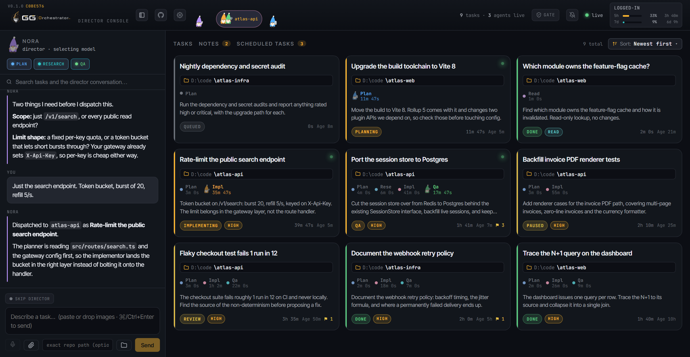
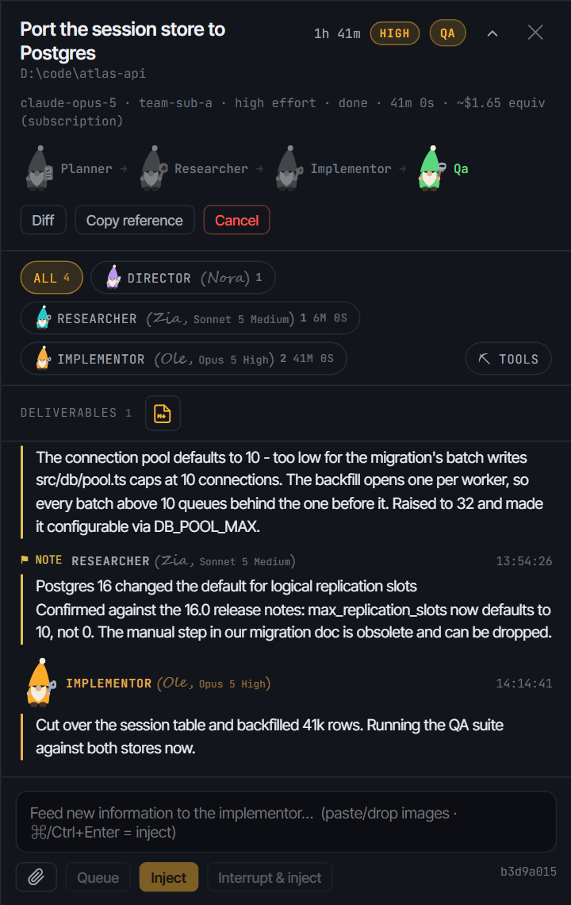
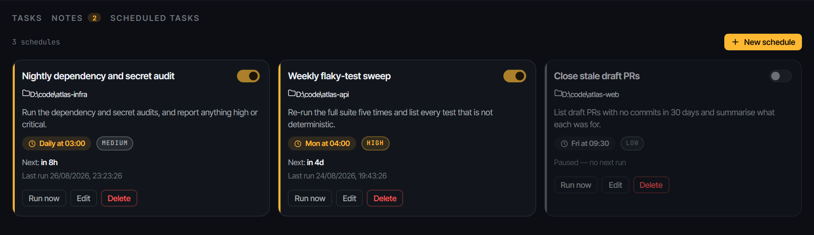
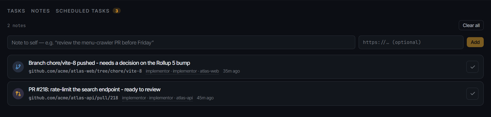

# GG Orchestrator

**Run five coding agents at once and actually stay on top of them.**

A local director's console for Claude Code. You describe a task in plain language;
a director agent asks the questions you'd otherwise forget to answer, then hands the
brief to a pipeline that plans, researches, builds and reviews it. Every task is a
card on a live board you can watch, interrupt, feed new information to, and resume.



It runs on your machine, against your repos, on your Claude subscription. There is no
hosted service and no metered API billing.

Agent questions appear as GGO question chips, with multiple-choice or free-text answers.
Claude and z.ai use the question tool; Codex and Grok use an `ASK_USER` JSON bridge.
The task waits for your answer and continues in the same session.

## Why it exists

The workflow this replaces is one people already do by hand:

1. Get a model to sharpen a rough prompt into a real brief.
2. Have it read the codebase enough to plan.
3. Start a strong agent on the work.
4. Stop it and feed it new information when something changes the picture.
5. Review what came back.

That is fine for one task. At five concurrent tasks you lose track of which agent knows
what, which one is stuck, and which one quietly finished twenty minutes ago. This is the
console for that problem.

## How a task runs

A dispatched task is a **thread**. Its route is chosen per task, from the task's own brief,
before any agent starts: a contained fix goes straight to an implementor, while broad,
ambiguous or risky work gets the full pipeline. The route note on the card says which
stages it chose and why.

- **Planner, task-selected.** Available for broad, ambiguous, or high-risk work, where it
  reads the codebase, writes the plan, and can request external research. Enabled means
  available, not automatically used for every task.
- **Researcher, optional and external only.** Web search, library docs, changelogs, issue
  threads. It deliberately does not read the codebase, because that is the planner's job.
- **Implementor.** Does change/build work. It is the only role required for such a task.
- **QA, task-selected.** Independently reviews and tests work where verification matters;
  it can bounce concrete fixes back to the implementor. A clean, contained task deliberately
  routed without QA finishes after the implementor verifies its own work.

Each finished stage is persisted, so a task that dies mid-pipeline (crash, restart,
rate limit) resumes from where it stopped rather than starting over. A task a server restart
interrupted resumes on the backend it was running on (a Codex session stays on Codex) while that
backend still has room, instead of being routed afresh.

**A pure lookup skips all of it.** "Which module owns the feature-flag cache?" does not
need a planner or a QA round, so the director dispatches it down a **read lane**: one
read-only agent answers by posting a finding, and the card gets a `READ` badge. If the
question turns out to need an edit, it automatically promotes the same task to the
smallest capable implementation route instead of half-answering.

**Bigger jobs have two opt-in modes.** A *timed* task keeps working for a window you set
("work on this for 8 hours"); the deadline survives restarts and provider hand-offs, and
it never aborts a turn that is already running. A *shotgun* task splits the work across
several agents and integrates their results. An implementor can also hand a slice of its
job to a **sub-task** on any enabled backend and model; the sub-task is its own card you
can open and talk to.

On desktop, the Director's Plan, Research, QA and Directives controls sit beside **For / With** above the message field. Expanding **For / With** hides those controls until it is collapsed again. Phones keep the compact header controls.

**Several agents in one repo stay out of each other's way.** Agents on the same checkout
share a chat room to divide files. When another agent shares the repo, a task claims its
own branch in a linked git worktree, then rebases and fast-forwards it back into the base
branch when it is done. A task alone in its repo just works in place.
Git writes from agents and the Git console share a transaction queue across linked
worktrees. Use `node server/scripts/git-transaction.cjs --repo <checkout> -- <program> <arguments>`
to run a commit helper or mutation script; the default queue wait is ten minutes.
Use `--timeout-ms <milliseconds>` before `--` to choose a shorter wait (0–600000).
The wait bounds admission to the queue; it does not interrupt an active transaction.
Registered callers take turns in arrival order. Each ticket holds an OS-backed lease,
so crashed waiters are skipped without using PID or age guesses. This protects queue
metadata; a native Git lock abandoned during a killed commit needs a separate audit.
On Windows, the CLI waits for native index locks before staging helpers run and can
archive a proven abandoned lock: it must be unchanged for two minutes, no Git process
may predate its last write (missing process metadata refuses recovery), exclusive
access must succeed, and the real index hash must remain unchanged. Lock bytes and
unique audit receipts stay under Git's common directory. Active or uncertain locks
remain untouched; other platforms require manual orphan auditing. Push/fetch skip
index preflight because they do not use the index.
Use `node server/scripts/git-integrate.cjs --repo <main-checkout> --worktree <task-checkout>`
for an atomic rebase and fast-forward, then verify and push if authorized. Commit reviewed
peer source and documentation in separately attributed commits before integrating;
do not wait for the original author. The lock releases when its process exits and never
removes Git's native locks. Reads, editing and tests stay parallel; file ownership still
needs coordination, and direct Git writes outside the wrapper do not join the queue.
Before an authorized push, fetch and review remote changes. Run the final fetch,
merge or rebase, and push in one mutation script wrapped once, checking every exit
status and stopping on conflicts. If that fetch reveals unreviewed commits, stop
for review before merging. The queue covers callers sharing a Git common directory;
another machine can still advance the remote. A rejected push requires a fresh
fetch, review and retry.
The background worktree cleanup runs its Windows process and disk-size probes
without opening PowerShell windows. Repository discovery checks each distinct
folder once; stale cleanup waits 30 seconds after finished-task retirement so
maintenance does not compete with initial startup.

**When a task parks for your review, you can delegate that too.** "Auto-review and mark
done" hands your review to a reviewer agent that inspects the change, runs the project's
checks, and asks you directly about anything only you can decide. It then marks the task
done in your place or hands it back with the reasons it could not sign off. It reviews
only: it never edits or commits.

A follow-up on an existing task keeps that task's original route. For a small
registration or launch follow-up, switch QA off in the task's agent controls if
you want it to finish after implementation. Switching QA off stops an active
review and persists for later resumes; switch it back to Auto to restore routing.

QA restart notices summarize pending instructions per recipient. Routine QA redelivery bookkeeping is retained in durable history but hidden from the task feed; owner instructions and attachments remain visible.

## A look around

The Task model dialog lets you pin an exact provider, model and supported effort for the next
implementor start. Effort on Auto lets GGO choose within subscription caps; Use Auto clears both
the model pin and effort override. Interrupt a running implementor before changing these choices.

Auto-select compares current accessible model families for ordinary tasks, retaining flagship
requirements for broad or risky work and preferring the newest available member of each line.
It considers every supported effort tier within your subscription caps, including XHigh,
Max and Ultra where supported. It chooses the smallest confident effort for the task. The board keeps
all tasks indexed for sorting and counts; completed cards load their previews and checkout details
only when their page becomes visible. Opening a task loads its full history separately.

The chat composer's repo path field is optional: a path typed there is used exactly as written.
The **Auto** switch inside the field's right edge picks the repo for each send instead. Quote paths
that contain spaces. A missing path pauses a multi-repo request for clarification. While Auto is
on, the field, its folder button and the REPOS chips are disabled. A path in your message, a repo
name it mentions, or a follow-up to the previous request decides the repo; when that is unclear, a
searchable picker lists the candidates, and the request is sent once you choose (**Don't send**
drops it). A request naming
several repos can become one task per repo. The setting persists; turn Auto off to choose manually.

Open a task and you get its whole trail: which agents ran, what they cost, what they
found, and any file they produced. The composer at the bottom injects new information
into the running agent without restarting it.



Findings are how agents talk to each other and to you. An agent posts one the moment it
learns something that changes the plan, so a discovery made by the researcher is in front
of the implementor before it writes the wrong thing.

The board has a tab for each area. Any tab except Tasks can be hidden per browser, and the tabs can
be put in any order: drag one along the board header, or use Settings → Interface → Tab order.

- **Tasks.** The live board. A **Co-work** session also lives here: a conversation you lead
  turn by turn, where one agent does what you ask, verifies it and hands control back.
  Co-work never becomes a task, so no planner or QA steps in.
  **Hide done** hides done and cancelled tasks, including pinned tasks; turn it off to show them again.
- **IDE.** Browse, search and edit any workspace's files, with a git surface for branches,
  diffs, commits, history, fetch, pull and push. See [docs/ide-workspace.md](docs/ide-workspace.md).
- **Notes.** One list of what waits on you personally. Agents post a branch or a PR here
  when they need you to look; you click it, deal with it, and delete the line.
- **Calendar.** Month, week, day and agenda views of your own events, your reminders and
  every scheduled task, in your browser's time zone. A plain event sends nothing. An event
  with a reminder, or a standalone reminder, reaches you as a Discord DM when phone
  notifications are set up, and on the note list otherwise. From the calendar you can skip,
  move, pause or edit a scheduled run. Calendar content stays in the local database.
- **Scheduled Tasks.** Recurring briefs on a cron schedule, each optionally pinned to an
  exact backend, model and effort. Every fire is a full task that can edit, commit and push, so a nightly
  audit or a weekly flake sweep runs itself.
- **Goals.** A standing objective driven until it is met. Sequential goals continue one
  persistent agent session by default; the director audits completion claims and intervenes
  after an unclean turn, an owner change or a dead session. You can instead allow up to 8
  parallel step tasks, with the director judging their reports and planning the next steps.
  Each goal card shows its steps, the milestones the agent reported, and anything blocked
  or waiting on you. Optional token budgets and a burn-rate guard pace the goal's quota use.
- **Supervisor.** The opt-in **Director Supervisor**, off by default. When on, it uses
  lifecycle checks and an adaptive backstop sweep, and spends a short no-tools agent
  judgement only on genuinely stalled or forgotten work. The tab shows every check, reason,
  action, token/cost estimate and notification decision. It can add a note, correct a live
  agent, safely resume a task, alert you, or hand a review to the auto-reviewer. It never
  cancels, retries, deletes or marks a task done itself.
- **Patch notes.** What changed in your install, and what the next update brings, read
  straight from its git history. Days start folded with summaries and change counts;
  click a day to show or hide its notes, or use **Show all days / Hide all days**.
- **Remote control** (Windows only, appears once set up in Settings). Streams this
  machine's desktop into the console and sends mouse, touch and keyboard back. It needs
  an ffmpeg with Desktop Duplication capture, and setup can install a pinned copy.
- **Script Hub, Surveillance, Home and Sidekick** (each off until you turn it on under
  Settings → Interface). Optional tabs for local services, each served by its own worker
  process that starts the first time you open the tab and exits when idle. Surveillance shows
  live cameras and browses and plays recordings. Script Hub hides agent-managed entries by default;
  each card's **Organize** control saves **My app / Agent-managed**, tags.
  Search includes tags and combines multiple search terms; clickable tags, a tag filter and name/recovery sorting organize the list.
  **Edit entry** saves names, descriptions, notes, aliases and launch settings to the local Script Hub registry;
  advanced JSON covers other entry fields. Conflicting saves are refused. Launch changes apply on the next start.
  Management labels and tags are saved on the server and do not change script supervision. Per-camera **Notifications on/off** controls
  enable a ping on picture-detected movement and an unread Surveillance tab count. Unread alerts
  make the tab throb from dark to bright red with a pulsing count, or a prominent motion button
  beneath the area selector on narrow screens (a steady highlight with reduced motion). Opening the tab
  clears the count. Alerts name the latest triggering camera; **Recent motion** inside Surveillance
  keeps the last 20 detections with camera names, times and a shortcut to each camera's settings.
  History survives reloads in the same browser tab until you clear it; opening Surveillance keeps it.
  Notifications default off and work while this console is open, including other
  board tabs. Cameras share one picture socket; each camera alerts at most once every 30 seconds.
  In camera settings, choose **Motion sensitivity → Low** for fewer false alerts, then **Save camera**.
  Medium keeps the original sensitivity; High detects smaller movements. Each camera saves its own level.
  Lighting or other picture changes can trigger detection; browser sleep pauses monitoring and
  sound needs a click in the console after loading. Click a camera picture (or its enlarge button)
  for a fullscreen view; scroll, pinch or use the zoom buttons to magnify, drag to pan, and
  Reset view to fit the picture again. This zoom magnifies the preview image. Nothing records
  until you choose 24/7 or a weekly schedule. Recording then runs on through restarts until you turn it off, with
  per-camera recording, file length, and optional keep-days or size caps. Home controls robot
  vacuums and edits their cleaning schedule, which runs as Home Assistant automations. See
  [docs/local-service-modules.md](docs/local-service-modules.md).





Also in the console:

- **Search** across every task's full conversation.
- **Agent memory.** GGO indexes your Markdown memory folder (`~/.claude/memory/` by
  default) and gives every agent the memories that matter for its prompt. Claude Haiku on
  your subscription picks them, with Codex Luna and then keyword ranking as fallbacks. GGO
  also extracts new memories from transcripts. No local model or database server is
  needed. Claude Code, Codex and Grok Build sessions outside GGO can use the same recall
  through small hook scripts. Settings → Memory shows status and lets you search and edit.
  See [docs/agent-memory.md](docs/agent-memory.md).
- **Notifications.** Browser notifications, a generic webhook, and Discord messages when a
  task finishes, needs you or fails. With Discord set up, you can also DM the bot to talk
  to the director.
- **The Online Office.** An optional link to orchestrators on other machines. When agents on
  different machines work in the same repository, they see each other and share its chat
  room. It needs the small relay service in [`relay/`](relay/README.md), which you host
  yourself. Open an office chat to see the live gnome count, names, roles, tasks and
  activity badges. Click a local gnome in the roster to open its task. Project rosters
  include teammates on other machines; the general Office roster is local, and the
  Directors room shows the directors currently present. Chat history stays available
  when nobody is working there. Use **Hide roster** to leave just the count and give
  the conversation more room; **Show roster** brings the names back. Your browser
  remembers the choice across rooms, reopening the chat and reloading.

## Runtime model

Every backend authenticates off a flat-fee subscription rather than a metered API key.
The server deliberately strips `ANTHROPIC_API_KEY` from the agent environment so a stray
key cannot silently route your agents onto per-token billing.

Claude runs through the [Claude Agent SDK](https://www.npmjs.com/package/@anthropic-ai/claude-agent-sdk),
which drives the Claude Code binary and inherits your existing CLI login. Default models:

| Role | Model |
| --- | --- |
| Director | `claude-opus-5-5` |
| Planner | `claude-opus-5-5` |
| Researcher | `claude-opus-5-5` |
| Implementor | `claude-opus-5-5` |
| QA | `claude-opus-5-5` |
| Reader (read lane) | `claude-opus-5-5` |
| Reviewer (auto-review) | `claude-opus-5-5` |

While a role's model is left on Auto in Settings, a narrow, well-scoped task routes its
implementor and QA to Claude Sonnet 5.5 instead, and the read lane runs on Sonnet too.
Goal steps, timed and shotgun work, and open-ended or flagship-grade work stay on Opus.
Settings > Auto model selection > "Sonnet for well-scoped work" turns this off.

Three other backends are optional, off by default, and enabled per machine under
**Settings > Subscriptions**: **OpenAI Codex** (ChatGPT plan), **xAI Grok** (SuperGrok),
and **Zhipu z.ai** (GLM Coding Plan). If Claude caps mid-task, work fails over to whichever
enabled backend still has headroom instead of stopping. Before a substantial run starts,
routing compares the task's estimated quota runway against every visible account/provider/model
pool (including Grok monthly credits and dedicated Codex model allowances); a nearly spent pool
loses to one that can carry the work. Weekly/monthly gates are weighted as longer windows, so they
still matter without treating one task as a whole weekly burn. If none can, the task shows the
limiting windows and waits for the first reset that actually makes a compatible pool viable, then
resumes automatically.

The Codex top-bar chip shows the reported ChatGPT credit balance in place of the 5-hour
meter when the plan has no 5-hour window, while keeping the weekly usage meter. The balance
is rounded up to a whole credit; hover for the decimal balance.

Each Claude and Codex subscription has **Allow credits to be spent** in **Settings >
Subscriptions**, off by default. It admits credit-backed runs only after every enabled
provider has exhausted its included allowance. Codex requires a positive, finite prepaid
balance and ChatGPT login; this fallback never switches to API-key billing. Claude requires
a matching profile token (the banked-reset token), enabled usage credits, a positive prepaid
balance, and verified auto-reload off. Missing, expired, or stale billing information blocks
the fallback. Anthropic API Console credits cannot fund a Claude subscription run.
GGO never purchases credits or enables auto-reload. Provider billing settings govern
credit use within an already-running turn; this routing switch is not a provider billing
control. A real credit rejection parks work rather than repeatedly retrying it.
Codex telemetry does not report automatic credit purchase settings: turn automatic top-up off
in the provider's billing settings before enabling this fallback to spend only existing funds.
Balance freshness is checked separately from usage meters, so a new meter reading cannot
extend an older balance's 20-minute eligibility window.

An optional free task pool (**Settings > Free AI connections**) can run the planner or
reader of a small, low-risk task on a free-tier API. Everything else stays on the
subscription backends. See [docs/free-ai-provider-connections.md](docs/free-ai-provider-connections.md).

**Settings > Claude cloud** sends repository-only work to Anthropic-hosted Claude
Code sessions. The default path opens Claude with the repository and brief filled in;
review the account, branch, model and environment and start the session there.
Eligible promotional cloud session credits apply before regular plan usage.
The optional routine API path submits directly and saves session links, but
**routines are excluded from promotional cloud session credits** and spend regular usage.
Start an eligible task only after checking the balance. Subscription usage chips show cloud
dollars and expiry when a matching profile token can read them; unknown reads show
`cloud ?`. These dollars never increase local agent quota or prepaid fallback funds.
For automatic offload, enable subscriptions and allow repositories under **Automatic
cloud subtasks**. Agents mark standalone Claude subtasks with `cloudWork: "review"`
or `"change"`; when a subscription caps, GGO starts a normal hosted cloud session,
waits for its result and returns it to the parent for review. For an explicit cloud
request, add `cloudOnly: true`: verified promotional credits can be used before a
cap, and a refused admission starts no local agent. `cloudWork` alone permits local
routing and reports why cloud admission failed. Explicit cloud work uses only pushed
HEAD; unrelated pending local files stay on this machine. Account identity,
fresh promotional funds, paid usage credits off, and pushed repository state
are checked before dispatch; automatic cap fallback also requires a clean checkout. Cloud changes use a separate branch; GGO does not merge
or deploy them. Cloud children offer a hosted session link; resume, retry and review
are handled in Claude or the parent task. Each session has a $5 estimated budget
ceiling and a 40-turn limit.
This uses the OAuth session protocol observed in Claude Code 2.1.292, rather than a
public automation API; provider changes can require an adapter update. Interrupted
or uncertain sessions are never automatically resubmitted.
GGO cannot enforce credits-only spending. Start an
independent cloud task there, or interrupt a local task and use **Send to cloud**.
Jobs keep running with this PC off. Monitor, stop, and review
results in Claude before merging. Local services, files, memory and attachments are
not sent. This explicit lane does not participate in automatic provider fallback.
Setup and limitations: [Claude cloud sessions](docs/claude-cloud-sessions.md).

In **Settings > Usage & limits > Prepare a sub for reset**, **Auto-burn** (off by default)
automatically enables burn routing for enabled Claude or Codex subscriptions with a known weekly
reset within 24 hours. The soonest reset goes first, capped subscriptions are skipped, and manual
burn choices take priority. Turning Auto-burn off stops automatic burns. It does not redeem banked
resets; existing burn routing still respects hard limits and task model/provider choices.

In **Settings > Usage & limits > Usage safeguards**, the **Token safety limit** (off by default)
parks running work with its session saved and holds new dispatches once live usage reaches the
chosen percentage. **Only during set hours** limits it to chosen weekdays and a start and end time,
for example Monday to Friday 08:00 to 16:00, in an explicit IANA time zone that follows daylight
saving. An end before the start runs overnight. Outside those hours the limit is suspended, so held
work resumes and queued work starts as provider capacity allows. When the hours begin, running work
already over the limit is parked, as when the limit is switched on. Provider caps and tasks you
paused are never overridden. The panel shows whether the limit applies now and its next change.
With the schedule off, the limit applies around the clock, as before.

**More than one Claude subscription?** Set `ACCOUNT_1_TOKEN`, `ACCOUNT_2_TOKEN` and so on
(up to 8). New agent launches prefer the subscription with fewer active agents among those
with enough task-sized runway and under their soft weekly safety ceiling. This spreads a burst
of tasks before usage readings catch up. Equal loads use perishable weekly allowance first
(or lowest weekly usage with **Spread usage** on). The same balancing applies across eligible
backends; task model/provider pins and **Prepare a sub for reset** still take priority.
Finished agents release their slots, and saved sessions keep their existing routing rules.
The top bar shows live 5-hour and weekly usage per subscription.

## Quick start

Requires **Node 22 or newer** (not enforced anywhere, but that is what it is developed and
run against) and a working `claude` CLI login. `git` must be on your PATH for the git
surfaces, worktrees and patch notes.

Patch notes automatically finish loading the last calendar day across page boundaries.
Busy days show their summary once the day has ended, without an extra click on
"Show older changes".

```bash
git clone https://github.com/Fearce/garden-gnome-orchestrator.git
cd garden-gnome-orchestrator

npm install          # the repo root; installs concurrently, used by dev/serve
npm run install:all  # server/, web/ and relay/

npm run serve        # server + web console
```

Then open <http://127.0.0.1:4317>.

Nothing has to be configured to start. Every setting has a default, and the Agent SDK
picks up the credentials your `claude` CLI already has.

For a headless or always-on setup, where there is no interactive CLI login to inherit,
mint a subscription token and put it in `server/.env`:

```bash
claude setup-token   # then: CLAUDE_CODE_OAUTH_TOKEN=... in server/.env
```

The console runs on macOS, Linux and Windows. Remote control is the one Windows-only area.

<details>
<summary><b>Linux and npm 12: two extra first-run steps</b></summary>

`better-sqlite3` is a native addon, and npm 12 blocks package build scripts by default, so
its `node-gyp rebuild` never runs and the server crashes at boot with *"Could not locate the
bindings file"*. Approve it once:

```bash
cd server
npm install-scripts approve better-sqlite3
npm rebuild better-sqlite3
```

`ls node_modules/better-sqlite3/build/Release/better_sqlite3.node` should then exist. On
older npm this is automatic. Other blocked scripts (`esbuild`, `tree-sitter-*`) are not
needed to boot. Re-run this whenever you delete `node_modules`.
</details>

### Configuration

Per-machine settings live in `server/.env`, which is gitignored. Copy
[`server/.env.example`](server/.env.example) and fill in only what you need; every value is
documented inline there. Most feature switches (backends, notifications, the supervisor,
remote control, the Online Office) live in the console's Settings panel instead. The
environment variables worth knowing about:

| Variable | What it does |
| --- | --- |
| `CLAUDE_CODE_OAUTH_TOKEN` | Subscription token from `claude setup-token`. Optional locally. |
| `ACCOUNT_<n>_TOKEN`, `_LABEL`, `_ID` | Additional Claude subscriptions to balance across (n = 1..8). |
| `AUTH_PASSWORD` or `GOOGLE_CLIENT_ID` + `GOOGLE_CLIENT_SECRET` | Gates the listener. Required before the server will bind to anything but localhost. |
| `SESSION_SECRET` | Strong random cookie-signing key. If unset, GGO generates a new key on every start and existing sessions expire. |
| `PROXY_ORIGINS` | Comma-separated browser origins for a loopback reverse proxy that rewrites Host and omits X-Forwarded-Host, e.g. `https://console.example.com`. Permits the origin check only; sign-in is still required. |
| `OWNER_NAME` | Your name, woven into the agent prompts. |
| `NO_PUSH_REPO_PATTERN` | Agents commit but never push any repo whose origin URL matches this pattern. |
| `DEFAULT_WORKSPACE`, `WORKSPACE_SEARCH_ROOTS` | Where the console looks for your repos. |
| `DISCORD_BOT_TOKEN`, `DISCORD_USER_ID` | Fallbacks for the Discord notifications and reminder DMs; the Settings panel wins. |
| `NOTIFY_WEBHOOK_URL` | A webhook pinged when a task needs you or finishes. |
| `DATA_DIR` | SQLite state and logs. Defaults to `server/data`. |
| `PORT`, `HTTPS_PORT` | Default `4317` and `4319`. TLS is optional and skipped if no cert is present. |

**On exposure:** this is built for localhost and your own LAN. If `HOST` is set to anything
non-local without a password or Google sign-in configured, the server refuses and binds back
to `127.0.0.1`. Do not put it on the public internet directly. For access from anywhere, use
the Google-locked Tailscale Funnel link in [docs/remote-access.md](docs/remote-access.md)
(`npm run remote-access -- on`), which keeps the listener on `127.0.0.1`.
An ordinary reverse proxy must still use GGO sign-in; forwarded requests cannot call local-only
deploy routes without a session.
If the proxy rewrites Host, preserve `X-Forwarded-Host` on WebSocket upgrades or set
`PROXY_ORIGINS` to the exact external origin(s), without a path prefix. The proxy must retain
forwarding metadata (such as `X-Forwarded-For` or `CF-Connecting-IP`) on HTTP and WebSocket
requests. This works independently of `REMOTE_ACCESS`, which opts into Google-only tunnel
sign-in. Unlisted origins remain refused; restart the server after changing its environment.

**What stays local:** the database, attachments and logs live under `server/data/` by default
(or your configured `DATA_DIR`). Environment settings live in the gitignored `server/.env`;
credentials saved in Settings stay in the local database, and CLI logins use each provider's
own credential storage. Keep any custom data directory outside Git. Your tasks,
transcripts, notes and calendar never leave the machine, except through the backends you
enable, the notification channels you set up, and the Online Office relay if you join one.

### Run modes

| Command | Use it for |
| --- | --- |
| `npm run serve` | Normal use. Server without file watching, plus the web dev server. |
| `npm run dev` | Working on the server. Adds `tsx watch`, which hot-restarts on changes and **kills in-flight tasks**. |
| `npm run build && npm start` | Production. Serves the built console from `:4317` alone. |
| `npm run typecheck` | server, web and relay. |
| `npm run test:gates` | The full local test suite. No agents or quota; three gates run at a time, slowest first by the last run's timings. Set `GGO_GATE_JOBS=1` to diagnose timing-sensitive failures serially. |

Production console rebuilds retain previous hashed assets in `web/dist`, so rebuilding does
not first erase the running console or its lazy-loaded chunks. Disposable lab builds use
`--emptyOutDir`; do not clear the production output while it is being served.

### Desktop app (optional)

The browser console is the full product. On Windows x64 you can also run it in its own window:

```bash
npm run desktop:install   # once
npm run desktop           # build and launch from source
npm run desktop:dist      # or: an installer in desktop/release/
```

The app shows the same console from the same server, so every feature and live update is
identical. It adds a taskbar window whose title bar is the console's top bar, a screen that
finds your server or starts a stopped local one, and links that open GGO on a task. Closing the
window never stops the server or its agents. Switch between the two with **Open in web** (in
the app) and **Open in desktop** (in the browser, on a machine where the app has run); either
way you stay signed in, on the same task. Use the browser for phones, tablets, remote access
and macOS/Linux. Building, connecting to another server, updating and security are covered in
[desktop/README.md](desktop/README.md).

## Layout

The task board pages large histories, including 30 entries per page in the Closed holding
area. Live updates to other agents do not redraw the open
task's transcript. Changes chips load compact task counts; their full Git drawers load when
you approach or open them, so an idle board does not fetch every card's commit history.

`npm run probe:startup` measures cold/warm desktop and throttled-phone startup.
`node server/scripts/module-latency.cjs` checks live HTTP, WebSocket and event-loop
latency without sending owner messages or interrupting camera recording.

```
server/   Fastify HTTP + WebSocket backend, the Agent SDK runtime, SQLite state
web/      React + Vite director console
relay/    Optional standalone relay, so orchestrators on different machines
          can see each other's agents on a shared repo
desktop/  Optional Electron window around the console (Windows x64)
docs/     ARCHITECTURE.md (the design contract), DECISIONS.md, feature guides
```

[docs/ARCHITECTURE.md](docs/ARCHITECTURE.md) is the full design, and it is kept current.
[docs/DECISIONS.md](docs/DECISIONS.md) records what was adopted or rejected and why.

## Contributing

Issues and pull requests are welcome. Before opening a PR:

- Run `npm run typecheck` and `npm run test:gates`. Both are local and cost nothing.
- Use [Conventional Commits](https://www.conventionalcommits.org/) (`feat:`, `fix:`,
  `refactor:`, `chore:`), matching the existing history.
- Keep one concern per commit.
- Use neutral examples in code, tests and docs: `example.com`, the `192.0.2.x`
  documentation addresses, `alex`/`sam` for people. The repo is public, and
  `node server/scripts/privacy-guard.cjs` (part of the gate suite) fails on home-directory
  paths, public IP addresses, real-looking account ids, tailnet names and personal e-mail
  addresses. Put your own names and project words, one regex per line, in the gitignored
  `server/.privacy-terms` so the guard catches them too.

The work board is [docs/BACKLOG.md](docs/BACKLOG.md), shared by contributors and agents.

There is no CI on this repo yet, so the local gates are the gate.

A note on scope: the **Voice mode** panel in Settings talks to a voice gateway that lives in
a separate project and is not shipped here. Everything else in the console is in this repo.

## Quiet direct gnome inbox

Open **Office > Gnome inbox** to find local gnomes, inspect their incoming and sent
messages, and send a quiet message as the owner. Messages persist across restarts,
show unread/read status, and support earlier history. Owner inspection never marks
an agent's mail read. A direct message never interrupts, wakes, resumes or dispatches
an agent; an away gnome reads it when it next works. The directory lists only gnomes
that are working now or ran within the last 24 hours; older ones are hidden (mail
addressed to their threadId and role is still accepted). Remote gnomes still use the
Online Office rooms.

Claude agents use `inbox_directory`, `inbox_send`, `inbox_read`, and
`inbox_acknowledge` on the office MCP server. CLI agents receive a scoped
`gnome-inbox.cjs` command in their kickoff instructions: `directory`, `read`
(optional before-id), `send` (JSON recipient and body on stdin), and `ack` (through-id).
The capability grants only that task/role's inbox; keep it private. Agents check
at convenient work checkpoints and before handoff and explicitly acknowledge the
messages they have handled. Sending persists mail; it does not promise an immediate
reply. Existing active sessions gain the inbox instructions on their next kickoff.


## License

[MIT](LICENSE).
