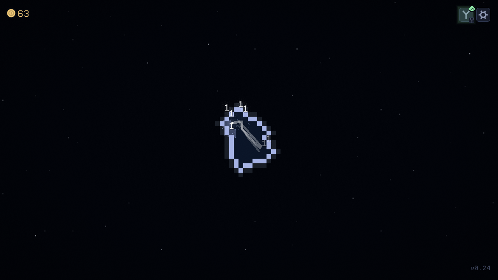

**Tilebreaker: Steam feasibility and demo recommendation**

Research date: 26 September 2026. Prices are USD unless another currency is stated. Recommendations are judgments, not sales forecasts.

**Yes, Tilebreaker is worth testing as a paid game. I would fund a small demo-and-feedback round, not commit to a large commercial expansion yet.** My provisional price is **$3.99**, with **$4.99** reasonable if the finished campaign earns it. The strongest positioning is a finite, satisfying incremental destruction game: build an elemental swarm, excavate a world, and discover that world was only a small part of the next one.

It is not ready for a paid launch on the evidence available. It is much closer to a useful public demo. General run saving, a satisfying ending, demonstrated pacing, and release-build performance matter more now than another large batch of upgrades.

And the personal question: wondering whether something you made deserves money does not establish that you are having a midlife crisis. This is a reasonable creative project with an uncertain market. Give it a bounded experiment; its sales need not become a verdict on your life.

**What I actually examined**

I inspected the sibling repository at `C:/Users/Mikkel/projects/tilebreaker`, its release source at `04ce8ac7eda4c3fb02cdff8caa1fe062f04a154e` / v0.24, its dirty working tree, and current Steam and Galaxy pages. I ran the project's browser verifier against the public release, pressed the start node, and opened the resulting 1280×720 screenshot. The public build reported that exact commit in `build-info.json`. [Play the release](https://prismicious.github.io/tilebreaker-releases/).

This was an opening-session smoke test and source audit, **not a full campaign playthrough, audience study, native Windows certification, or performance benchmark**. I cannot honestly declare the whole game fun, quote its actual completion time, or assign a defensible probability of commercial success from that evidence.

The distinction between release and work in progress is crucial:

| Area | Evidence and commercial implication |
|---|---|
| Core loop | Release source has automated balls, tile destruction, currency, a purchase tree, seven swarm types, bosses, and active abilities. This is already a game with substantial systems. |
| Progression | Release constants specify four levels, starting 448 cells wide and doubling each level. Some README paragraphs still name older sizes. Bigger fields alone do not establish more worthwhile playtime. |
| Fractal hook | v0.24 has expanding arenas and a camera reveal. The newer shrink-the-cleared-board-into-a-2×2-pocket transition is staged work, absent from the release tree inspected. It is a promising differentiator to finish and demonstrate, not a shipped claim. |
| Saving | v0.24 has settings, lifetime statistics, and special pending-transmutation checkpoint machinery. General `RunSaveStore` and browser checkpoint additions are staged work. Do not mistake those special checkpoints for routine run persistence. |
| Ending | In release `scripts/game/game.gd`, `_finish_run()` stops running, cancels the reveal, and plays a sound. This needs a deliberate player-facing conclusion and restart path before selling a finite campaign. |
| Idle expectations | Away-time catch-up was deliberately removed; source comments explicitly say time is not banked. Position it as incremental/auto-battling, and explain background behavior. Do not promise offline earnings. |
| Desktop | `export_presets.cfg` contains a Windows Desktop export, but the project's guidance says desktop builds have not been the verified product. Steam readiness is more than exporting an executable. |
| Performance | The working backlog records native p95 readings of 46–60 ms against a 16.7 ms budget, under concurrent machine load. That is an unresolved measurement, not proof that the public browser release runs at that speed. |

The working tree also contains mobile and statistics work. I did not count those additions as released or change any game files. Documentation is inconsistent in places; release source and the public build identity take precedence.



The opening has a coherent dark-space look, readable currency, and a visible excavation. Most of the frame is still dark, and the upgrade control is largely symbolic. My inference: this image alone undersells the eventual spectacle. A new-player hint and an early, visible power increase are higher-value experiments than adding decoration. This is a hypothesis from the opening capture, not a claim that every new player is confused.

**What the market comparison says**

These are deliberately selected comparables, not a representative sample of every idle release. Review totals are dated page snapshots, not unit sales; language and purchase filters differ. Release ages differ too. Do not turn this table into a sales conversion formula.

| Game | Observed price / review signal | Lesson for Tilebreaker |
|---|---|---|
| [Nodebuster](https://store.steampowered.com/app/3107330/Nodebuster/) | Store rendered €2.99; [US price reference](https://steamdb.info/app/3107330/) $2.99. 10,641 English reviews, 97% positive. Released August 2024. | A short, abstract upgrade game can be commercially visible. Strong escalation and a clear identity matter; abstraction is not disqualifying. |
| [Tower Wizard](https://store.steampowered.com/app/3372980/Tower_Wizard/) | $2.99; 7,154 English reviews, 96% positive. Released June 2025. | Its explicit finite ending and evolving activities set a strong low-price comparison. A large tree is not a sufficient selling point by itself. |
| [Space Rock Breaker](https://store.steampowered.com/app/4035270/Space_Rock_Breaker/) | $2.99; 2,486 English reviews, 96% positive. Released December 2025. | Close destruction/upgrade competition, with a distinct ore-processing activity and an available demo. Tilebreaker needs its own memorable payoff. |
| [To The Core](https://store.steampowered.com/app/1988550/To_The_Core/) | $7.99; retrieved Japanese-language page showed 5,009 all-language reviews, 92% positive. Released August 2023. | Destruction can sustain a higher price when supported by places, resources, upgrades, and a clear journey. This is an upper comparison, not a launch-price instruction. |
| [(the) Gnorp Apologue](https://store.steampowered.com/app/1473350/the_Gnorp_Apologue/) | 7,391 English reviews, 95% positive; retrieved price was regional yen, omitted from USD comparisons. Released December 2023. | Visible production and a recognizable cast make increasing numbers legible and memorable. Tilebreaker can pursue that clarity through swarm behavior and world scale. |
| [Brick Breaker Upgrade](https://store.steampowered.com/app/4346980/Brick_Breaker_Upgrade/) | Retrieved search snapshot: 26 scored reviews, 65% positive, Mixed. Released March 2026. | A much closer warning: bricks, special balls, automation, and a skill tree do not by themselves guarantee satisfaction or traction. |
| [Brick Breaker](https://store.steampowered.com/app/1756930?l=english) | Six reviews in the retrieved snapshot. Released January 2022. | A content list including unique balls and 14 bosses does not ensure discovery. Low review volume is not a measured revenue figure. |
| [Idle Bouncer](https://store.steampowered.com/app/697610/Idle_Bouncer/) | Free with in-app purchases; 460 reviews, 80% positive. Released September 2017. | Players can get a ball-based incremental loop free. A paid Tilebreaker must sell a complete experience, convenience, and execution. |

The successful games prove that this category has paying customers. The smaller examples prevent the misleading conclusion that any competent incremental will inherit those customers. None establishes Tilebreaker's demand. I would treat a modest hobby release as plausible, meaningful side income as unproven, and income replacement as unsupported.

**What to finish, and what to leave alone**

The following order is a proposed commercial checklist, not an edit to the game's authoritative backlog.

1. **Protect progress.** Land and verify general run saves on the actual web release and desktop build. Test reload, browser close, update/migration, interrupted writes, and intentional reset. Preserve the distinction between a saved run and earnings while absent.
2. **Make the first ten minutes understandable.** Show what the tree button does, what the player is working toward, and the effect of a purchase. Test without explaining the game aloud. Keep the screen uncluttered after the player understands it.
3. **Finish the reveal and make it reachable in the demo.** The player should experience the expanding-world premise, not only read about it. If the normal first arena takes too long, author a smaller demo progression with honest labeling.
4. **Measure the complete progression.** Record time to first purchase, new ball types, first boss, each level, tree completion, and final clear. Identify stretches where a player has nothing meaningful to do or anticipate. Retune costs and break rates before increasing content. The working backlog itself flags economy changes associated with the new boards.
5. **Create closure.** Add a visible completion moment, run summary, and clear replay/reset choice. A short campaign needs a payoff proportionate to its build-up. A challenge replay mode is optional if testers want it.
6. **Prove shipping quality.** Validate dense late-game effects and transitions in the exported browser build and on an ordinary Windows laptop. Test scaling, audio, reduced effects, input, save recovery, and a clean installation. Resolve performance uncertainty before claiming minimum specs.
7. **Package the Steam product.** Make capsule art, concise store copy, and a gameplay trailer showing weak-to-powerful progression and the reveal. Verify Windows launch/exit and saves through Steam. Cloud saves and a small set of meaningful achievements are worthwhile additions, though not blanket requirements to list a game.

Do not make endless depth, prestige, multiplayer, a perfect internal tree editor, more currencies, or a rewrite prerequisites for this experiment. The current design deliberately lets players buy the whole tree; preserve that unless playtests show purchase order is uninteresting. Its commercial promise can be a finite journey. The unfinished editor is a production inconvenience, not automatically a player-facing launch blocker.

**Price and economic feasibility**

My default is **$3.99 list price**. It sits between strong $2.99 competitors and your $5 ceiling. This is a positioning judgment; there is no measured demand curve for Tilebreaker yet.

Use **$2.99** if the finished experience is very brief and lightly varied. Use **$4.99** if strangers report a satisfying campaign with several meaningful changes, a memorable finish, and reliable saves. A provisional design target of roughly 3–6 engaging hours could support that price, but it is neither an industry rule nor a measured duration for this build. Extra waiting does not add value. Avoid charging less solely because making it has become familiar to you.

Steam's general refund offer covers purchases within fourteen days with under two hours played. That makes truthful expectations important; it is not a reason to pad the game past two hours. [Steam refund policy](https://store.steampowered.com/steam_refunds/).

For scale only, assume receipts of **50–65% of US list price per sold copy**, an illustrative combined allowance for storefront share, regional pricing, discounting, consumption taxes, and refunds. This is a planning assumption, not Valve's contractual payout formula, and excludes your development costs and income tax.

| Copies sold | At $3.99 | At $4.99 |
|---:|---:|---:|
| 100 | $200–259 | $250–324 |
| 1,000 | $1,995–2,594 | $2,495–3,244 |
| 5,000 | $9,975–12,968 | $12,475–16,218 |
| 10,000 | $19,950–25,935 | $24,950–32,435 |

These are scenarios, not probabilities or predicted sales. Budget for the low case until actual audience behavior changes the evidence. For example, valuing 100 additional hours at $25 plus $500 of cash expenses gives a $3,000 incremental cost: approximately 1,157–1,504 copies at $3.99 under those assumptions. Count future support time too. Past effort is already spent; the decision is whether the next bounded investment is worthwhile.

Steam Direct costs $100 per product, plus applicable taxes, and recoups that fee after at least $1,000 Adjusted Gross Revenue. Fee recoupment is a separate threshold from earning back your own costs. [Valve's fee documentation](https://partner.steamgames.com/doc/gettingstarted/appfee).

**Galaxy is useful, with a specific caveat**

Yes, prepare a Galaxy demo. Give it a satisfying mini-arc, label it plainly, and use it to learn where players lose interest. A proposed 20–40-minute slice should include several noticeable purchases, more than one swarm behavior, and the fractal reveal before its endpoint. That duration is a target to test, not a claim about current pacing. End with a thank-you and one optional Steam link, rather than repeated sales interruptions.

Galaxy's February 20, 2026 announcement says games tagged `demo` are excluded from the default homepage's recently updated list and placed in a separate recent-demos list. It defines demos by most content being or becoming paywalled. Demos are still welcome, but the announcement describes fatigue with similar $3–5 Steam upsells. Do not disguise a paid-game demo as a full free game to avoid the tag. [Galaxy's announcement](https://galaxy.click/forum/thread/860).

The existing threadless Godot web export is a useful starting point. Test the actual embedded build, not only its standalone URL: loading, focus, sizing, audio activation, fullscreen, storage/reload, and a backgrounded tab. Galaxy provides an iframe tester and a messaging API for integrations such as cloud saves; those are not automatically supplied by local IndexedDB saving. [Galaxy developer documentation](https://galaxy.click/docs/dev).

Keep a stable demo URL and be explicit about whether progress transfers to Steam. Save portability is useful; do not promise it until implemented. The existing free public release also needs a fair explanation: preserve an understandable free version or demo boundary and describe exactly what the paid version adds. Removing access is not evidence of added value.

**How close, and the cheapest way to find out**

Feature-wise, this is beyond an initial prototype. Commercially, it is **pre-demo-validation**, with release work still outstanding. A completion percentage would hide the biggest unknown: whether strangers enjoy the whole progression.

My scheduling allowance is **1–3 focused weeks to a tested demo candidate**, then **another 3–6 weeks to a small Steam release candidate** if feedback supports the current design. These are low-confidence planning ranges, not engineering estimates from timed implementation. They assume the staged save/reveal work is sound, limited scope, and no major performance or pacing redesign. Outside testing and store review create calendar time that faster coding cannot remove.

Valve's public Steam Direct page currently states a 30-day fee-to-release waiting period for the first few titles and a brief review process. A Coming Soon page must be public for at least two weeks. Set those up early once the game has stable positioning, and check the actual Steamworks checklist before selecting a date. [Steam Direct](https://partner.steamgames.com/steamdirect), [Coming Soon documentation](https://partner.steamgames.com/doc/store/coming_soon?language=english).

Start with ten people who like incrementals and have not helped build this game. Watch their first session without coaching. Then test a revised demo with another 20–30 people. Record starts, first purchases, reveal reached, completion, voluntary continued play, and where people stop. Ask what they expected next and whether the proposed price feels fair. Purchase intent is weaker evidence than actual purchase behavior.

For a deliberately small first gate, I would want at least 8 of the first 10 to start and buy an upgrade without help, at least 6 to reach the intended payoff, no lost saves, and several independently asking for more. These are proposed decision rules, not market benchmarks or statistically reliable conversion estimates. If most cannot understand the loop, fix onboarding. If they understand it but do not want more after two focused revisions, pause commercial expansion or release it as a small free project.

If the demo works, make the Steam page the destination for interest from Galaxy, a browser host such as itch.io, and short gameplay clips. Track sources separately. A small, well-matched creator list is more useful than assuming Steam discovery will do the work. Set a spend/time cap before this phase; do not keep adding features indefinitely to avoid showing the game to people.

**Recommendation:** finish the bounded demo, test the reveal and pacing, and reserve the Steam launch decision until those results arrive. Tilebreaker has enough substance to justify this experiment. Whether it deserves $4 depends on the experience it delivers; whether the work was worth doing is a broader question than its revenue.

**Evidence and verification record**

The browser command run was:

```powershell
powershell -NoProfile -File C:/Users/Mikkel/projects/tilebreaker/tools/web_verify.ps1 -Url https://prismicious.github.io/tilebreaker-releases/ -Shot C:/Users/Mikkel/projects/garden-gnome-orchestrator/docs/reports/tilebreaker-2026-09-26/live-run.png
```

Result: exit 0; opening tree backdrop changed from 98.1% to 0.0% after starting; 1280×720 capture; public v0.24 commit confirmed. The screenshot was opened and inspected. [Raw browser verification record](live-run.txt).

Source checks used `git show HEAD:<path>` and `git ls-tree` to separate release code from staged changes. Key paths: `scripts/game_config.gd`, `scripts/game/game.gd`, `scripts/core/level_plan.gd`, `export_presets.cfg`, `README.md`, and working `BACKLOG.md`. The general-save and new fractal files were not present in the inspected release tree. No gameplay changes were made, and the game's unit suite was not rerun for this research-only task. No Galaxy submission, Steam account setup, purchase, or publication was performed.

Market pages were retrieved on the research date, sometimes through cached search snapshots. Counts can differ on revisit; they are not simultaneous audited market data. The study includes successful and low-visibility examples but cannot establish a market-wide base rate. It has no owner sales, wishlist, acquisition, refund, full-playthrough, or independent retention data. Those are the remaining evidence needed for a firmer commercial decision.
